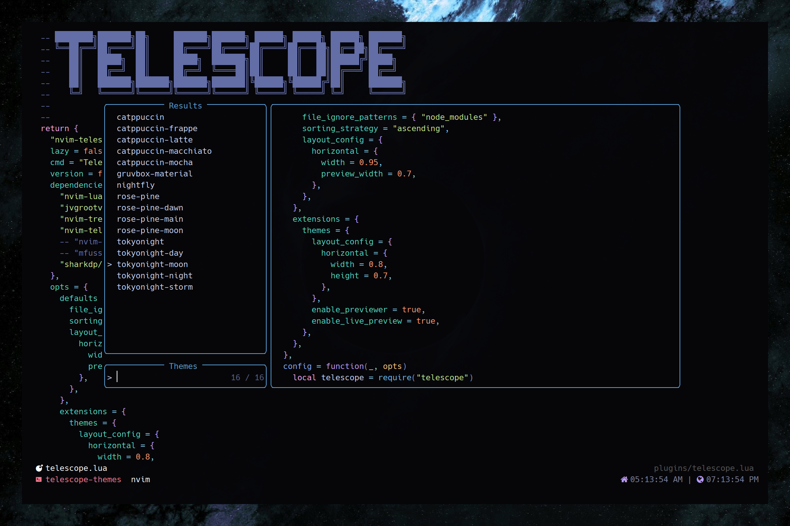

# Telescope Themes

An extension for Telescope plugin to switch colorschemes with preview. It will read all your installed themes



## Installation

Using [lazy.nvim](https://github.com/folke/lazy.nvim)

```lua
{
    'andrew-george/telescope-themes',
    config = function()
        require('telescope').load_extension('themes')
    end
}
```

_OR_

As a dependancy in telescope config file (example in lazy.nvim)

```lua
{
    'nvim-telescope/telescope.nvim',
    cmd = 'Telescope',
    lazy = true,
    dependencies = {
        'andrew-george/telescope-themes',
        -- other dependencies
    },
    config = function()
        -- load extension
        local telescope = require('telescope')
        telescope.load_extension('themes')
    end
}
```

## Usage

```lua
:Telescope themes
```

or map it to a key

```lua
vim.keymap.set("n", "<leader>th", ":Telescope themes<CR>", {noremap = true, silent = true, desc = "Theme Switcher"})
```

## Configuration

The extension can receive any telescope option in addition to custom options

NOTE: All configurations should go under `extensions` table in telescope config file

_Example Configuration ( NOT DEFAULT ):_

```lua
{
    "nvim-telescope/telescope.nvim",
    dependencies = {
        "andrew-george/telescope-themes",
        -- other dependencies
        },
    config = function ()
        -- get builtin schemes list
        local builtin_schemes = require("telescope._extensions.themes").builtin_schemes

        require("telescope").setup({
            extensions = {
                themes = {
                    -- you can add regular telescope config
                    -- that you want to apply on this picker only
                    layout_config = {
                        horizontal = {
                            width = 0.8,
                            height = 0.7,
                        },
                    },

                    -- extension specific config

                    -- (boolean) -> show/hide previewer window
                    enable_previewer = true,

                    -- (boolean) -> enable/disable live preview
                    enable_live_preview = false,

                    -- all builtin themes are ignored by default
                    -- (list) -> provide table of theme names to overwrite builtins list
                    ignore = { "default", "desert", "elflord", "habamax" },
                    -- OR
                    -- extend the required `builtin_schemes` list to ignore other
                    -- schemes in addition to builtin schemes
                    ignore = vim.list_extend(builtin_schemes, { "embark" }),

                    -- (table)
                    -- (boolean) ignore -> toggle ignore light themes
                    -- (list) keywords -> list of keywords that would identify as light theme
                    light_themes = {
                        ignore = true,
                        keywords = { "light", "day", "frappe" }
                    },

                    -- (table)
                    -- (boolean) ignore -> toggle ignore dark themes
                    -- (list) keywords -> list of keywords that would identify as dark theme
                    dark_themes = {
                        ignore = false,
                        keywords = { "dark", "night", "black" }
                    },

                    persist = {
                        -- enable persisting last theme choice
                        enabled = true,

                        -- override path to file that execute colorscheme command
                        path = vim.fn.stdpath("config") .. "/lua/colorscheme.lua"
                    },
                    mappings = {
                        -- for people used to other mappings
                        down = "<C-n>",
                        up = "<C-p>",
                        accept = "<C-y>",
                    },
                },
            },
        })
    end
}
```

#### Options

|          Key          |                    Value                     |                                                                                                                            Description                                                                                                                             |
| :-------------------: | :------------------------------------------: | :----------------------------------------------------------------------------------------------------------------------------------------------------------------------------------------------------------------------------------------------------------------: |
|  `enable_previewer`   |                  `boolean`                   |                                                                                                                    Show / Hide previewer window                                                                                                                    |
| `enable_live_preview` |                  `boolean`                   |                                                                                                                   Enable / Disable live preview                                                                                                                    |
|       `ignore`        |            `list` of themes names            |                                                                                                         Ignore specific themes from appearing in the list                                                                                                          |
|       `persist`       |     `{ enabled: boolean, path: string}`      | - Enable / Disable persisting last theme choice,<br> - Override file path to write your colorscheme command <br> **`WARNING: THIS MUST BE AN EMPTY FILE AS IT WILL BE COMPLETELY OVERWRITTEN`** <br>Default file path : `{root_nvim_config}/lua/current-theme.lua` |
|      `mappings`       | `{down: string, up: string, accept: string}` |                                                                                 - Add custom mappings for navigating <br>Default: <br>`{down = <Down>, up = <Up>, accept = <CR>}`                                                                                  |
|    `light_themes`     |     `{ignore: boolean, keywords: list}`      |                                                                                       - toggle ignore light themes, and provide a list of keywords to identify light themes                                                                                        |
|     `dark_themes`     |     `{ignore: boolean, keywords: list}`      |                                                                                        - toggle ignore light themes, and provide a list of keywords to identify dark themes                                                                                        |

### IMPORTANT

As the extension is writing the colorscheme command in your config, and neovim configs are very indvidual and unique, I wouldn't be able to predict which part to manipulate,
so the extension creates a file named **current-theme.lua** will be generated in root of /lua directory, it contains the command responsible for persisting latest theme selection, and it's overwritten by the extension on every new selection.

Now you have to require **current-theme.lua** in your init.lua

### Credits

- It is inspired by [NvChad's](https://github.com/NvChad/NvChad) theme switcher, but written to work with any configuration.
  Now you have to require **current-theme.lua** at the end of your init.lua to apply that theme on every startup.
