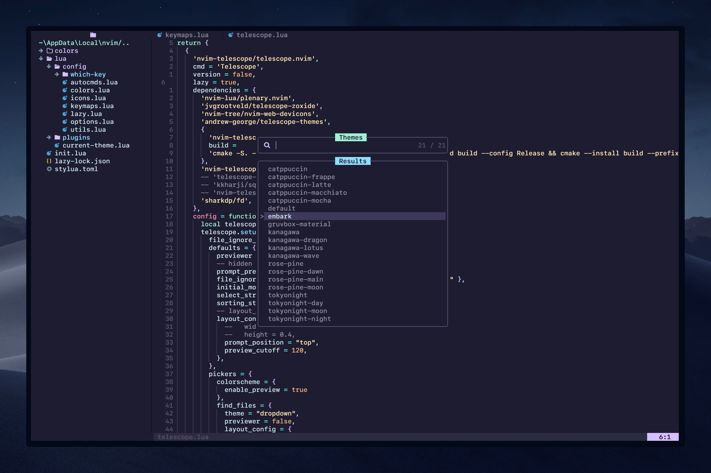

# Telescope Themes

An extension for Telescope plugin to switch colorschemes with preview. It will read all your installed themes (in addition to nvim builtin themes)



## Installation

1. Plugins config file

Using [packer.nvim](https://github.com/wbthomason/packer.nvim) or [lazy.nvim](https://github.com/folke/lazy.nvim)

```lua
use {
	'andrew-george/telescope-themes',
	config = function()
		require('telescope').load_extension('themes')
	end
}
```

2. As a dependancy in telescope config file (example in lazy.nvim)

```lua
{
    'nvim-telescope/telescope.nvim',
    cmd = 'Telescope',
    lazy = true,
    dependencies = {
		'andrew-george/telescope-themes',
		-- your other dependencies
    },
    config = function()
	    -- load extension
	    local telescope = require('telescope')
	    telescope.load_extension('themes')
    end
},
```

## Usage

```lua
:Telescope themes
```

or map it to a key
```lua
vim.keymap.set("n", "<leader>th", ":Telescope themes<CR>", {noremap = true, silent = true, desc = "Theme Switcher"})
```

### IMPORTANT
As the extension is writing the colorscheme command in your config, and neovim configs are very indvidual and unique, I wouldn't be able to predict which part to manipulate,
so the extension creates a file named **current-theme.lua** will be generated in root of /lua directory, it contains the command responsible for persisting latest theme selection, and it's overwritten by the extension on every new selection.

Now you have to require **current-theme.lua** in your init.lua

### Credits
- It is inspired by [NvChad's](https://github.com/NvChad/NvChad) theme switcher, but written to work with any configuration.
Now you have to require **current-theme.lua** at the end of your init.lua to apply that theme on every startup.
